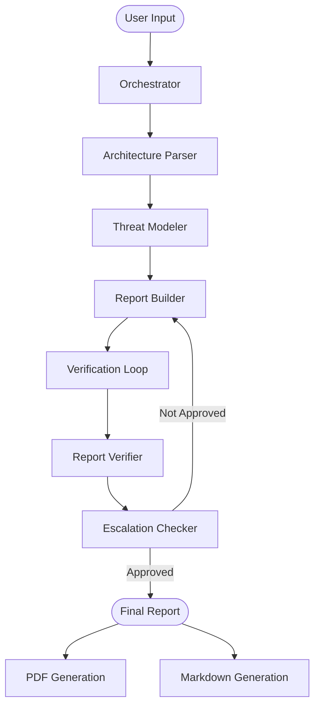

# AutoThreat AI

**Architecting Resilience at the Speed of Thought**

An automated threat modeling platform built with **Google Agent Development Kit (ADK)** and **Gemini**. AutoThreat AI uses a multi-agent workflow to analyze system architectures and generate comprehensive security threat reports for the autonomous enterprise.

## Architecture

The system follows a sequential multi-agent workflow orchestrated by a **Threat Model Orchestrator**:

1. **Architecture Parser Agent**: Extracts system components, data flows, and trust boundaries from text descriptions or uploaded diagrams.
2. **Threat Modeler Agent**: Identifies vulnerabilities and threats using STRIDE methodology.
3. **Report Content Builder Agent**: Compiles findings into a comprehensive, professional security report in Markdown format.
4. **Verification Loop** (iterative):
   - **Report Verifier Agent**: Audits and validates the report against security best practices.
   - **Escalation Checker Agent**: Determines if the report meets quality standards.
   - The loop continues (up to 3 iterations) until the report is approved or max iterations are reached.



## Features

- **Multi-Agent Workflow**: Orchestrated pipeline with specialized agents for each stage
- **Iterative Refinement**: Automatic report verification and refinement loop
- **Web UI**: Modern frontend with real-time agent status tracking
- **Streaming Responses**: Server-Sent Events (SSE) for real-time progress updates
- **File Upload Support**: Upload architecture diagrams for analysis
- **PDF Reports**: Automatic generation of professional PDF threat model reports
- **Visual Feedback**: Agent pipeline visualization with status indicators

## Setup

### Prerequisites

- Python 3.14+
- `uv` package manager
- Google API Key or Vertex AI credentials

### Installation

1. Clone the repository:

   ```bash
   git clone <repository-url>
   cd agentic-threat-modeler
   ```

2. Install dependencies with `uv`:

   ```bash
   uv sync
   ```

3. Set your Google API Key in a `.env` file:

   ```env
   GOOGLE_API_KEY=your_api_key_here
   # OR for Vertex AI:
   GOOGLE_GENAI_USE_VERTEXAI=True
   GOOGLE_CLOUD_PROJECT=your-project-id
   GOOGLE_CLOUD_LOCATION=global
   ```

## Usage

### Running the Full System

Start all agents and the frontend server:

```bash
uv run python run_local.py
```

This will:

- Start all 5 agents as FastAPI endpoints (ports 8001-8005)
- Start the frontend server on port 8000
- Display status information and URLs

### Accessing the Application

- **Frontend UI**: <http://localhost:8000>
- **Orchestrator API**: <http://localhost:8005>
- **Individual Agents**: <http://localhost:8001-8004>

### Using the Web UI

1. Open <http://localhost:8000> in your browser
2. Enter your architecture description in the text area
3. Optionally upload a reference diagram (PNG, JPG, etc.)
4. Click "Start Analysis"
5. Watch the agent pipeline process your request in real-time
6. Download the final PDF report when complete

### API Endpoints

The frontend server (`app/server.py`) provides:

- `GET /` - Frontend UI
- `POST /api/sessions` - Create a new session
- `POST /api/query` - Stream query to orchestrator (SSE)
- `GET /api/health` - Health check
- `GET /api/reports/latest-pdf` - Get latest PDF report info
- `GET /api/reports/download/{filename}` - Download PDF report

## Project Structure

```
agentic-threat-modeler/
├── agents/                      # Individual agent implementations
│   ├── architecture_parser/     # Architecture parsing agent
│   ├── threat_modeler/          # Threat identification agent
│   ├── report_content_builder/  # Report generation agent
│   ├── report_verifier/         # Report validation agent
│   └── threat_modeller_orchestrator/  # Main orchestrator
├── app/                         # Frontend and server
│   ├── frontend/                # HTML, CSS, JavaScript UI
│   ├── server.py                # FastAPI server for frontend
│   └── serve_agents.py         # Agent startup script
├── shared/                      # Shared utilities and tools
│   ├── tools/                   # Agent tools (file writing, PDF conversion)
│   └── utils/                   # Utility functions
├── reports/                     # Generated reports (MD and PDF)
├── logs/                        # Agent log files
└── run_local.py                # Main script to run all services
```

## Agent Communication

Agents communicate using ADK's Agent-to-Agent (A2A) protocol:

- Individual agents run as FastAPI endpoints on ports 8001-8004
- The orchestrator coordinates the workflow and runs on port 8005
- Agents can be accessed individually or through the orchestrator

## Development

### Running Individual Agents

To run agents individually for development:

```bash
# Start a specific agent
uv run uvicorn app._agent_wrapper_<agent_name>:app --host 0.0.0.0 --port <port>
```

### Logs

Agent logs are stored in the `logs/` directory:

- `architecture_parser.log`
- `threat_modeler.log`
- `report_content_builder.log`
- `report_verifier.log`
- `threat_modeler_orchestrator.log`
- `fastapi_app.log`

## Troubleshooting

- **Agents not starting**: Check that ports 8001-8005 are not in use
- **Import errors**: Ensure `uv sync` has been run and dependencies are installed
- **API connection errors**: Verify the orchestrator is running on port 8005
- **PDF generation issues**: Check that the `reports/` directory exists and is writable

## License

[Add your license information here]
