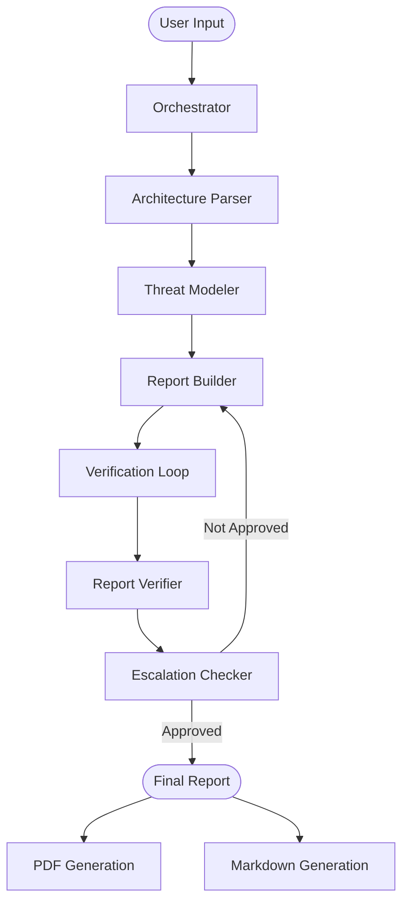

# AutoThreat AI

### Architecting Resilience at the Speed of Thought

An automated threat modeling platform built with **Google Agent Development Kit (ADK)** and **Gemini**. AutoThreat AI uses a multi-agent workflow to analyze system architectures and generate comprehensive security threat reports for the autonomous enterprise.

## Architecture

The system follows a sequential multi-agent workflow orchestrated by a **Threat Model Orchestrator**:

1. **Architecture Parser Agent**: Extracts system components, data flows, and trust boundaries from text descriptions or uploaded diagrams.
2. **Threat Modeler Agent**: Identifies vulnerabilities and threats using STRIDE methodology.
3. **Report Content Builder Agent**: Compiles findings into a comprehensive, professional security report in Markdown format.
4. **Verification Loop** (iterative):
   - **Report Verifier Agent**: Audits and validates the report against security best practices.
   - **Escalation Checker Agent**: Determines if the report meets quality standards.
   - The loop continues (up to 3 iterations) until the report is approved or max iterations are reached.


```mermaid
flowchart TD
    A([User Input]) --> B[Orchestrator]
    B --> C[Architecture Parser]
    C --> D[Threat Modeler]
    D --> E[Report Builder]
    E --> F[Verification Loop]
    F --> G[Report Verifier]
    G --> H[Escalation Checker]
    H -->|Not Approved| E
    H -->|Approved| I([Final Report])
    I --> J[PDF Generation]
    I --> K[Markdown Generation]
```

## Features

- **Multi-Agent Workflow**: Orchestrated pipeline with specialized agents for each stage
- **Gemini Model Selection**: Choose from supported Gemini models (e.g. Gemini 3 Flash Preview, Gemini 3 Pro Preview, Gemini 2.5 Flash, Gemini 2.5 Pro) via a dropdown in the UI
- **Vertex AI (local only)**: When running locally (not in Docker), the UI offers Vertex AI configuration (project ID and location); in containers only API key auth is used
- **Iterative Refinement**: Automatic report verification and refinement loop
- **Web UI**: Svelte frontend with real-time agent status tracking
- **Streaming Responses**: Server-Sent Events (SSE) for real-time progress updates
- **File Upload Support**: Upload architecture diagrams for analysis
- **PDF Reports**: Automatic generation of professional PDF threat model reports
- **Mermaid-to-PNG**: Report builder converts Mermaid diagrams to PNG via **Node.js** [@mermaid-js/mermaid-cli](https://www.npmjs.com/package/@mermaid-js/mermaid-cli) (no Python mermaid package, to avoid dependency conflicts). Requires Node.js and npx.
- **Visual Feedback**: Agent pipeline visualization with status indicators

## Setup

### Prerequisites

- Python 3.14+
- `uv` package manager
- Node.js 18+ and npm (for Svelte frontend and Mermaid PNG export; install mermaid-cli: `npm install -g @mermaid-js/mermaid-cli`)
- Google API Key or Vertex AI credentials

### Installation

1. Clone the repository:

   ```bash
   git clone <repository-url>
   cd autothreatai
   ```

2. Install dependencies with `uv`:

   ```bash
   uv sync
   ```

3. (Optional) Set a default Google API Key in a `.env` file. You can also enter your API key and select the Gemini model in the Web UI when running:

   ```env
   GOOGLE_API_KEY=your_api_key_here
   # When running locally, Vertex AI can be enabled in the UI; then set:
   # GOOGLE_GENAI_USE_VERTEXAI=True
   # GOOGLE_CLOUD_PROJECT=your-project-id
   # GOOGLE_CLOUD_LOCATION=us-central1
   # GOOGLE_GENAI_MODEL=gemini-3-flash-preview
   ```

4. Build the Svelte frontend (required for the UI):

   ```bash
   cd app/frontend-svelte
   npm install
   npm run build
   cd ../..
   ```

   The server serves the Svelte app at http://localhost:8000 when `app/frontend-svelte/dist` exists. `run_local.py` builds the frontend automatically before starting.

## Usage

### Running the Full System

Start all agents and the frontend server:

```bash
uv run python run_local.py
```

This will:

- Start all 5 agents as FastAPI endpoints (ports 8001-8005)
- Start the frontend server on port 8000
- Display status information and URLs

### Accessing the Application

- **Frontend UI**: <http://localhost:8000>
- **Orchestrator API**: <http://localhost:8005>
- **Individual Agents**: <http://localhost:8001-8004>

When running with **Docker** (e.g. `docker compose up`), the UI does not show Vertex AI options; use a Google API key and select a Gemini model in the dropdown. When running **locally** with `uv run python run_local.py`, the UI also offers Vertex AI configuration (project ID and location).

### Running with Docker

From the project root:

```bash
docker compose up --build
```

- **Agents** are built from `agents/Dockerfile` and started via `agents/entrypoint.sh`. The entrypoint generates a per-agent FastAPI wrapper (`app/_agent_wrapper_<AGENT_NAME>.py`) that loads the agent from `agent_work/` and injects a **set-api-key** endpoint so the frontend can set API key, Vertex options, and **model_id** (Gemini model) on each agent before a run.
- **App** is built from `app/Dockerfile` (multi-stage: Node for Svelte build, then Python for the FastAPI server). It serves the Svelte frontend and proxies to the orchestrator, and sets `RUNNING_IN_CONTAINER=true` so the UI hides Vertex AI configuration.
- **Mermaid-to-PNG**: The agent image does not include Node.js by default. The report builder’s Mermaid→PNG tool requires `npx`/mermaid-cli; in Docker, diagram images may not be generated unless you extend the image to install Node and `@mermaid-js/mermaid-cli`. Reports will still include Mermaid code blocks.

### Using the Web UI

1. Open <http://localhost:8000> in your browser
2. In **Credentials**, select a **Gemini Model** from the dropdown (default: Gemini 3 Flash Preview) and enter your **Google API Key** (or, when running locally, enable **Use Vertex AI** and enter Project ID and Location).
3. Enter your architecture description in the text area
4. Optionally upload a reference diagram (PNG, JPG, etc.)
5. Click "Start Analysis"
6. Watch the agent pipeline process your request in real-time
7. Download the final PDF report when complete

**Note:** Vertex AI options are only shown when the app is running locally; in Docker they are hidden and API key authentication is used.

### API Endpoints

The frontend server (`app/server.py`) provides:

- `GET /` - Frontend UI
- `GET /api/config` - App config: `vertex_available`, `supported_models`, `default_model_id` (for model dropdown and Vertex visibility)
- `POST /api/sessions` - Create a new session
- `POST /api/query` - Stream query to orchestrator (SSE); accepts `model_id`, API key, and Vertex fields
- `GET /api/health` - Health check
- `GET /api/reports/latest-pdf` - Get latest PDF report info
- `GET /api/reports/download/{filename}` - Download PDF report

## Project Structure

```
autothreatai/
├── agents/                      # Individual agent implementations
│   ├── architecture_parser/     # Architecture parsing agent
│   ├── threat_modeler/          # Threat identification agent
│   ├── report_builder/          # Report generation agent
│   ├── report_verifier/         # Report validation agent
│   ├── orchestrator/            # Main orchestrator
│   ├── Dockerfile               # Image for all agents (Python + uv)
│   └── entrypoint.sh            # Generates wrapper + set-api-key for each agent
├── app/                         # Frontend and server
│   ├── Dockerfile               # Multi-stage: Node (Svelte build) + Python (server)
│   ├── frontend-svelte/         # Svelte + Vite frontend (build to dist/)
│   └── server.py                # FastAPI server for frontend
├── shared/                      # Shared utilities and tools
│   ├── tools/                   # Agent tools (file writing, PDF conversion, Mermaid→PNG)
│   └── utils/                   # Utility functions
├── reports/                     # Generated reports (MD and PDF)
├── logs/                        # Agent log files
└── run_local.py                # Main script to run all services
```

## Agent Communication

Agents communicate using ADK's Agent-to-Agent (A2A) protocol:

- Individual agents run as FastAPI endpoints on ports 8001-8004
- The orchestrator coordinates the workflow and runs on port 8005
- Agents can be accessed individually or through the orchestrator

## Development

### Running Individual Agents

To run agents individually for development:

```bash
# Start a specific agent
uv run uvicorn app._agent_wrapper_<agent_name>:app --host 0.0.0.0 --port <port>
```

### Logs

Agent logs are stored in the `logs/` directory:

- `architecture_parser.log`
- `threat_modeler.log`
- `report_builder.log`
- `report_verifier.log`
- `orchestrator.log`
- `fastapi_app.log`

## Troubleshooting

- **Agents not starting**: Check that ports 8001-8005 are not in use
- **Docker agents**: Ensure `agents/entrypoint.sh` is executable and the image was built from project root (`docker compose build`). The entrypoint injects set-api-key (API key, Vertex, model_id) into every agent wrapper.
- **Import errors**: Ensure `uv sync` has been run and dependencies are installed
- **API connection errors**: Verify the orchestrator is running on port 8005
- **PDF generation issues**: Check that the `reports/` directory exists and is writable
- **Mermaid diagram blank or not appearing**: The tool runs **npx -y @mermaid-js/mermaid-cli** to render. Install Node.js, then run `npm install -g @mermaid-js/mermaid-cli` (or ensure `npx` is on PATH so the first run can fetch it). Check `report_builder.log` for conversion errors.
- **Disk usage**: The server periodically deletes old files in `uploads/` (default: older than 24h) and `reports/` (default: older than 7 days). Configure with `UPLOADS_MAX_AGE_HOURS`, `REPORTS_MAX_AGE_DAYS`, and `CLEANUP_INTERVAL_SECONDS` (default 3600s)
- **Orchestrator log: `AttributeError: 'BaseApiClient' object has no attribute '_async_httpx_client'`**: This is a known follow-on error in the Google GenAI client when a run fails (e.g. missing API key). The real error is earlier in the log (e.g. "Missing key inputs argument"). Ensure you provide a Google API key or Vertex AI credentials in the UI. Upgrading `google-genai` (e.g. `uv sync` with `google-genai>=1.62.0`) may reduce or fix this cleanup error.

## License

[Add your license information here]
